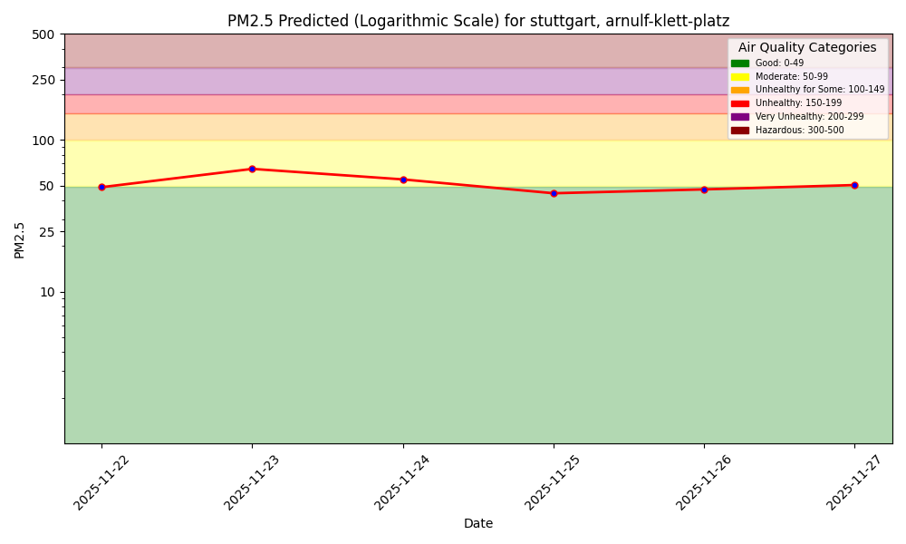
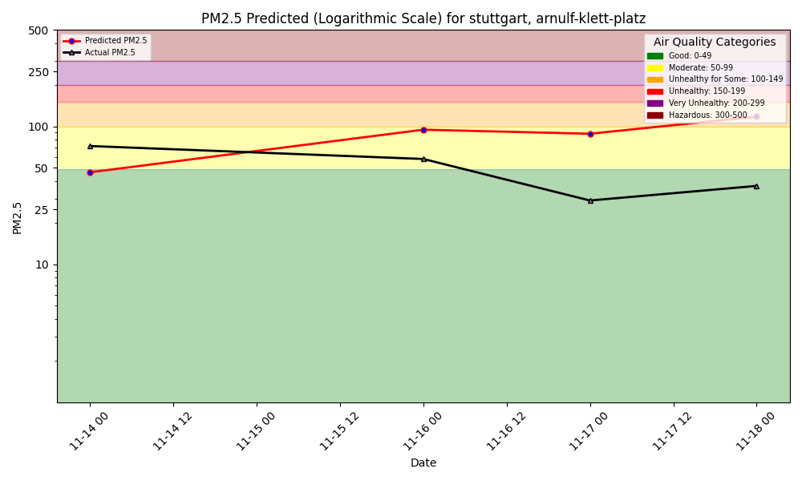
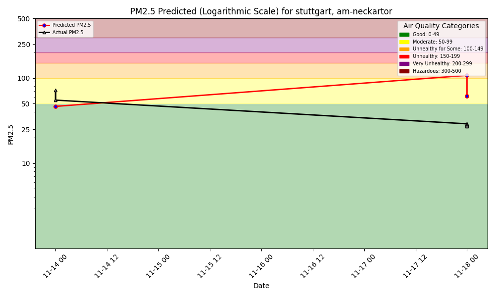

# Air Quality Dashboard - Stuttgart



## Arnulf-Klett-Platz Sensor

### 7-Day Forecast

### Model Performance Monitoring

1-Day Hindcast: Predictions vs Outcomes

---

## Am Neckartor Sensor

### 7-Day Forecast

### Model Performance Monitoring

1-Day Hindcast: Predictions vs Outcomes

---

There is also a Python program to interact with the air quality ML system using language (text, voice),
powered by a [function-calling LLM](https://www.hopsworks.ai/dictionary/function-calling-with-llms).
