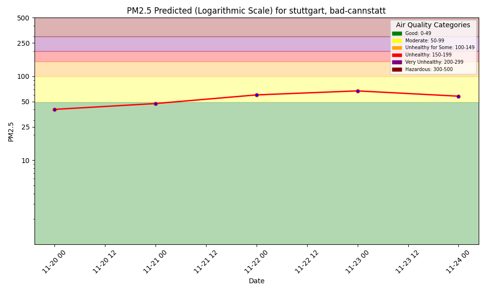
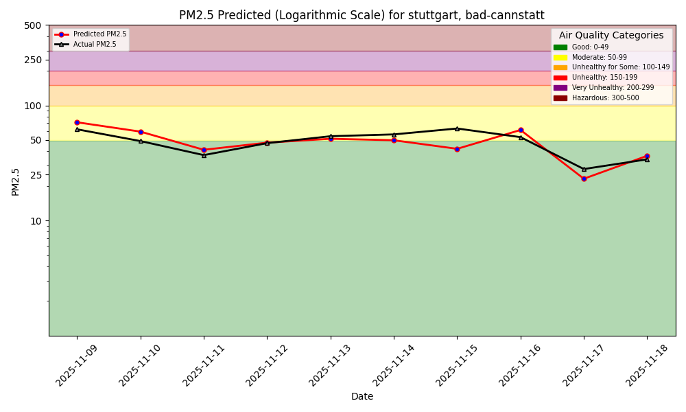
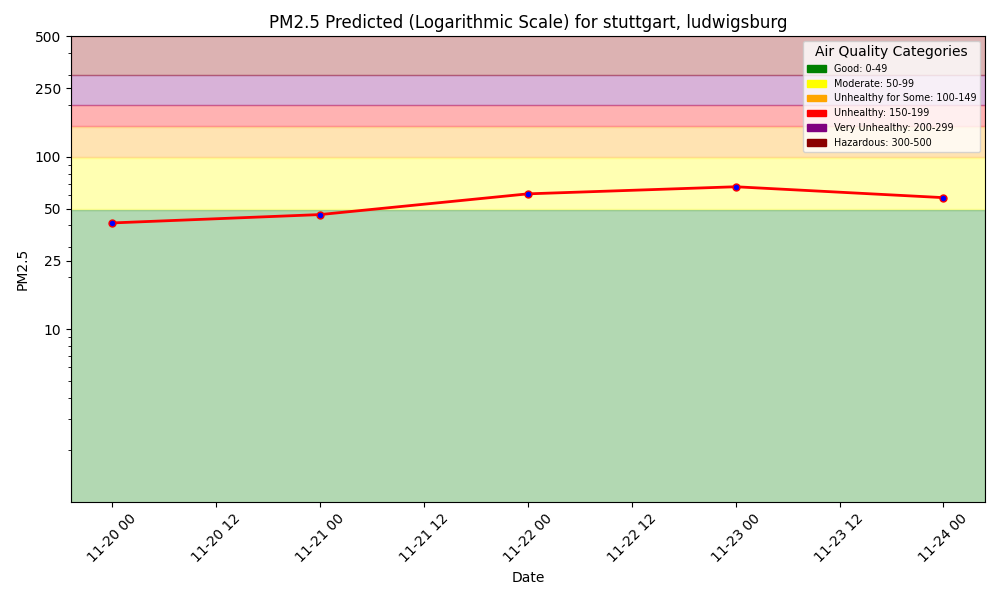
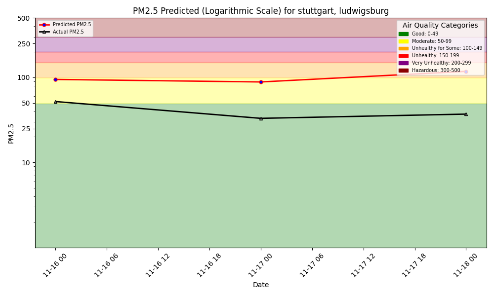
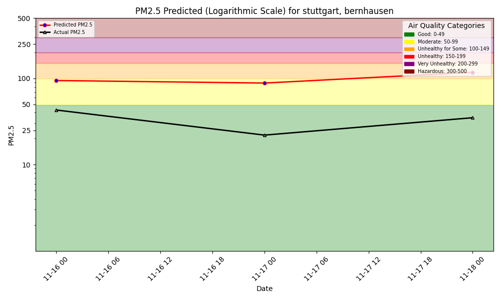

# Air Quality Dashboard - Stuttgart



## Arnulf-Klett-Platz Sensor

### 7-Day Forecast

### Model Performance Monitoring

1-Day Hindcast: Predictions vs Outcomes

---

## Stuttgart Am Neckartor Sensor

### 7-Day Forecast

### Model Performance Monitoring

1-Day Hindcast: Predictions vs Outcomes

---

## Bad Cannstatt Sensor

### 7-Day Forecast

### Model Performance Monitoring

1-Day Hindcast: Predictions vs Outcomes

---

## Ludwigsburg Sensor

### 7-Day Forecast

### Model Performance Monitoring

1-Day Hindcast: Predictions vs Outcomes

---

## Bernhausen Sensor

### 7-Day Forecast

### Model Performance Monitoring

1-Day Hindcast: Predictions vs Outcomes

---
